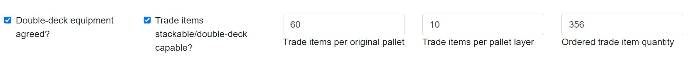

# GS1 Pallet Bay Calculator

This is a software prototype based on a heuristic for calculating the number of required pallet bays for an order of trade items. The underlying guideline was developed by a GS1 Germany working group.

## Demo

An interactive demo is available [here](https://gs1-germany.github.io/palletBayCalculator).

### Illustrative Example

Imagine you (or your customer) have ordered the following trade items:

- 356 bottles of Shower Gel
- 362 bottles of Shampoo
- 366 bottles of Conditioner

#### Objective

Determine the number of pallet bays needed to efficiently transport these items per truck. This tool assists your company in making calculations to optimise truck utilisation.

#### Usage

For each trade item, provide the following information:

1. **Trade items per original pallet:** How many bottles fit on one full pallet.
2. **Trade item per pallet layer:** How many bottles fit on one pallet layer.
3. **Ordered trade item quantity:** The quantity of bottles ordered.

Additionally, specify two transport parameters:

4. **Double-deck equipment:** Indicate if there is a bilateral agreement for double-deck equipment.
5. **Trade items stackable/double-deck capable:** Specify if two pallets with this product can be stacked on top of each other.

All necessary details, except for ordered quantity and bilateral agreement as to double-deck equipment, should be accessible in the trade item’s master data file (e.g., provided through GDSN).

For instance, for the shower gel, the master data file may include the following data:

- 60 trade items per original pallet
- 10 trade items per pallet layer
- trade items are stackable

Further, the company may agreed double-deck equipment. Therefore, for this order position, the user can tick both checkboxes:

After clicking 'Add another order position', the tool determines the required pallet bays (in this case, 4), and is ready for the next order position, if required:

#### Source Code

You are welcome to integrate the source code on which this online demo is based into your own business application.

## Algorithm

For a detailed description, please refer to the following GS1 Germany guideline:

[Standardisierte Transportplanungskriterien. Eine standardisierte Methode zur Transportplatzberechnung in der FMCG Branche (Standardised Transport Planning Criteria. A standardised approach for calculating pallet bays in the FMCG sector)](https://www.gs1-germany.de/gs1-standards/umsetzung/fachpublikationen/detailansicht/87664/)

## License

 

Copyright 2020-2023 | Ralph Tröger <ralph.troeger@gs1.de>

Permission is hereby granted, free of charge, to any person obtaining a copy of this software and associated documentation files (the "Software"), to deal in the Software without restriction, including without limitation the rights to use, copy, modify, merge, publish, distribute, sublicense, and/or sell copies of the Software, and to permit persons to whom the Software is furnished to do so, subject to the following conditions:

The above copyright notice and this permission notice shall be included in all copies or substantial portions of the Software.

THE SOFTWARE IS PROVIDED "AS IS", WITHOUT WARRANTY OF ANY KIND, EXPRESS OR IMPLIED, INCLUDING BUT NOT LIMITED TO THE WARRANTIES OF MERCHANTABILITY, FITNESS FOR A PARTICULAR PURPOSE AND NONINFRINGEMENT. IN NO EVENT SHALL THE AUTHORS OR COPYRIGHT HOLDERS BE LIABLE FOR ANY CLAIM, DAMAGES OR OTHER LIABILITY, WHETHER IN AN ACTION OF CONTRACT, TORT OR OTHERWISE, ARISING FROM, OUT OF OR IN CONNECTION WITH THE SOFTWARE OR THE USE OR OTHER DEALINGS IN THE SOFTWARE.
