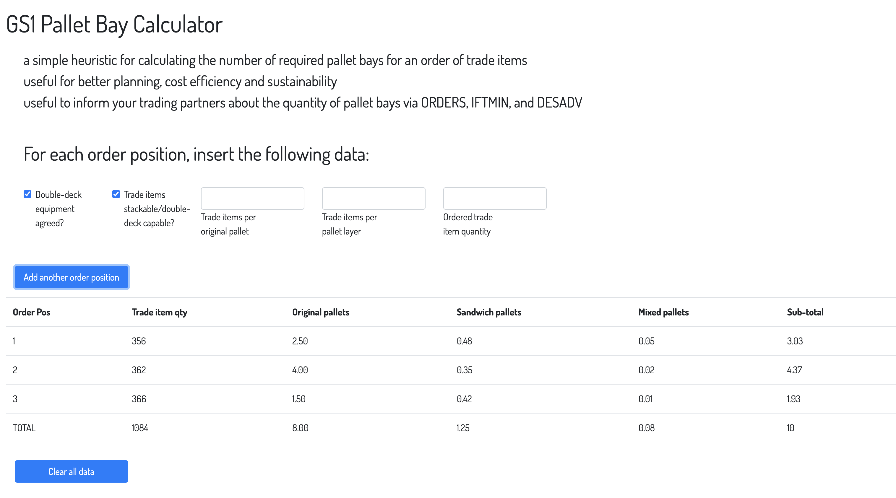

# GS1 Pallet Bay Calculator

This is a software prototype based on a heuristic for calculating the number of required pallet bays for an order of trade items. The underlying guideline was developed by a GS1 Germany working group.

## Status of this project

**This repository is no longer maintained and may be archived in the upcoming future. 
For an up-to-date and maintained version, go to this repository, forked and operated by GS1 Germany: https://github.com/gs1-germany/palletBayCalculator**

## Demo

An interactive demo is available at https://gs1-germany.github.io/palletBayCalculator

To calculate the total number of required pallet bays for a given order of trade items, just indicate the data for each order position:

## Algorithm

For a detailed description, please refer to the following GS1 Germany guideline:

[Standardisierte Transportplanungskriterien. Eine standardisierte Methode zur Transportplatzberechnung in der FMCG Branche (Standardised Transport Planning Criteria. A standardised approach for calculating pallet bays in the FMCG sector)](https://www.gs1-germany.de/gs1-standards/umsetzung/fachpublikationen/detailansicht/87664/)

## License

 

Copyright 2020-2023 | Ralph Tröger <ralph.troeger@gs1.de>

Permission is hereby granted, free of charge, to any person obtaining a copy of this software and associated documentation files (the "Software"), to deal in the Software without restriction, including without limitation the rights to use, copy, modify, merge, publish, distribute, sublicense, and/or sell copies of the Software, and to permit persons to whom the Software is furnished to do so, subject to the following conditions:

The above copyright notice and this permission notice shall be included in all copies or substantial portions of the Software.

THE SOFTWARE IS PROVIDED "AS IS", WITHOUT WARRANTY OF ANY KIND, EXPRESS OR IMPLIED, INCLUDING BUT NOT LIMITED TO THE WARRANTIES OF MERCHANTABILITY, FITNESS FOR A PARTICULAR PURPOSE AND NONINFRINGEMENT. IN NO EVENT SHALL THE AUTHORS OR COPYRIGHT HOLDERS BE LIABLE FOR ANY CLAIM, DAMAGES OR OTHER LIABILITY, WHETHER IN AN ACTION OF CONTRACT, TORT OR OTHERWISE, ARISING FROM, OUT OF OR IN CONNECTION WITH THE SOFTWARE OR THE USE OR OTHER DEALINGS IN THE SOFTWARE.
